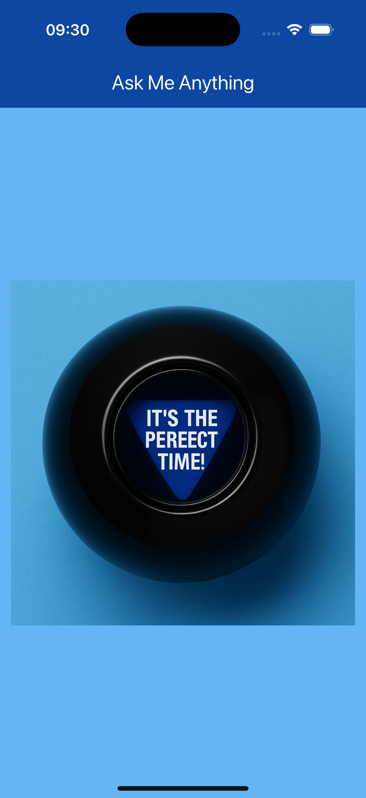

# Magic 8 Ball (Flutter)

A fun decision-making app based on the classic toy. This project acts as a "confidence builder," reinforcing the concepts of **State** and **Randomness** while introducing a simpler, centered layout.

  

## 🎯 Learning Outcomes
By building this project, you will learn:
- **Consolidation:** Reinforcing the use of `StatefulWidget` and `setState`.
- **Layouts:** Using the `Center` widget effectively for single-element designs.
- **Assets:** Managing and swapping multiple image assets dynamically.
- **Logic:** Mapping random integers (1-5) to specific asset filenames.

## 📱 Features
- **Tap to Predict:** Click the ball to reveal a new answer.
- **Randomized Answers:** 5 different responses (Yes, No, Ask Again Later, etc.).
- **Clean UI:** A minimalist, distraction-free interface using deep blue themes.

## 🚀 How to Run

1. **Ensure you are in the project directory:**
    
    `cd magic_8_ball`
    
2. **Install Dependencies:**
    
    `flutter pub get`
    
3. **Run the App:**
    
    `flutter run`

## 🔙 Back to Main Repo

Find more projects and the full learning roadmap here:
[Flutter Example Apps](https://github.com/thaisangdang/flutter_example_apps)

## 📘 Want to Build Bigger Apps?

This project is just the beginning. If you want to learn how to architect production-ready applications with scalable code, check out my premium guide:

👉 [**Master Flutter Architecture - Build a Production-Ready Social App from Scratch**](https://thaisang.gumroad.com/l/flutter-architecture-build-a-social-app)

## ☕ Support My Work

If you found this project helpful, consider [buying me a coffee](https://buymeacoffee.com/thaisangdang) to keep my work coming!